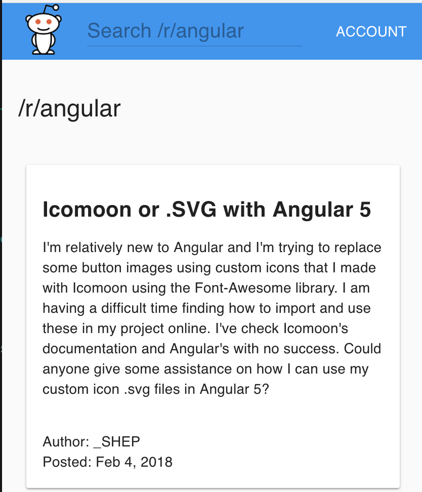

# demo-reddit-app
Angular 1.5 component-based starter using TypeScript, and Webpack. Built following [Todd Motto's Angular 1.x Style Guide](https://github.com/toddmotto/angular-styleguide).

### Install
```sh
git clone git@github.com:erictsai6/demo-reddit-app.git
cd demo-reddit-app
npm install
npm start
```

This will start the webpack dev server at [localhost:8080](http://127.0.0.1:8080/) in your browser.

Demo screenshot below


